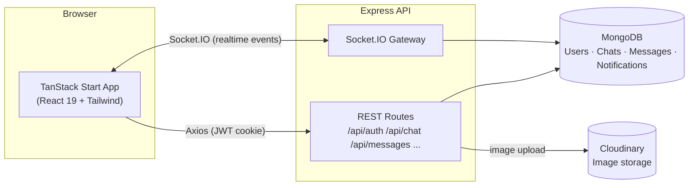

<div align="center">

# 💬 ChatSphere

**A realtime messaging workspace with presence, typing indicators, read receipts, and a glassy, animated interface.**

[](./LICENSE)
[](https://www.typescriptlang.org/)
[](https://react.dev/)
[](https://nodejs.org/)
[](https://www.mongodb.com/)
[](https://socket.io/)

[Features](#-features) • [Tech Stack](#-tech-stack) • [Getting Started](#-getting-started) • [API Reference](#-api-reference) • [Socket Events](#-socketio-events)

</div>

---

## 📖 Overview

ChatSphere is a full-stack, one-to-one realtime chat application. It pairs a TanStack Start (React 19) frontend with an Express + MongoDB backend, wired together over REST and Socket.IO for live messaging, presence, and typing state.

The interface leans into a "glass" aesthetic — soft blur surfaces, gradient accents, and an ambient Three.js particle scene — while the backend focuses on the fundamentals done right: participant-scoped chat rooms, server-verified message senders, httpOnly JWT cookies, and rate-limited auth routes.

## ✨ Features

- 🔐 **Authentication** — register/login with JWT stored in httpOnly cookies, protected routes, rate-limited auth endpoints
- 💬 **One-to-one chat** — create conversations, browse chat history, delete chats
- ⚡ **Realtime messaging** — instant delivery over Socket.IO, no polling
- 🟢 **Presence** — online/offline status tracked per-user across multiple open tabs/devices
- ⌨️ **Typing indicators** — live "user is typing…" state per chat
- ✅ **Delivered / seen receipts** — per-message delivery and read tracking
- 🖼️ **Image sharing** — uploads via Multer, stored on Cloudinary
- 🔎 **Search** — find users to chat with, search messages within a conversation
- 🔔 **Notifications** — in-app notification feed with unread counts and read/unread state
- 🎨 **Polished UI** — Tailwind CSS 4, Radix UI primitives, Framer Motion transitions, and an ambient Three.js background scene
- 🛡️ **Hardened by default** — Helmet security headers, CORS lockdown, rate limiting, and server-side authorization checks on every socket event (a client can't join a chat it isn't part of, or impersonate another user's message/typing/receipt events)

## 🧱 Tech Stack

| Layer | Technology |
|---|---|
| **Frontend framework** | [TanStack Start](https://tanstack.com/start) (React 19, SSR) + [TanStack Router](https://tanstack.com/router) |
| **Data fetching** | TanStack Query, Axios |
| **Styling** | Tailwind CSS 4, Radix UI, `class-variance-authority` |
| **Animation / 3D** | Motion (Framer Motion), React Three Fiber + Three.js |
| **Forms & validation** | React Hook Form, Zod |
| **Realtime client** | Socket.IO Client |
| **Backend framework** | Node.js + Express (TypeScript, ESM) |
| **Database** | MongoDB + Mongoose |
| **Realtime server** | Socket.IO |
| **Auth** | JWT (httpOnly cookies) + bcrypt password hashing |
| **File storage** | Multer (upload handling) + Cloudinary (image hosting) |
| **Security middleware** | Helmet, CORS, `express-rate-limit` |
| **Tooling** | Vite (Rolldown), ESLint, Prettier, tsx |

## 🏗️ Architecture



## 📂 Project Structure

```
ChatSphere/
├─ frontend/                 # TanStack Start app (React 19 + Vite)
│  └─ src/
│     ├─ routes/             # File-based routes: /, /login, /register, /chat
│     ├─ components/         # UI, auth, chat, and three.js scene components
│     ├─ hooks/               # use-auth, use-theme, use-mobile
│     ├─ api/                 # Axios clients per resource
│     └─ lib/                 # api-client, socket-client, utils
│
└─ backend/                  # Express API (TypeScript, ESM)
   └─ src/
      ├─ routes/              # auth, user, chat, message, upload, notification
      ├─ controllers/         # request handlers
      ├─ services/            # business logic
      ├─ models/              # Mongoose schemas: User, Chat, Message, Notification
      ├─ sockets/             # chat, presence, and typing event handlers
      └─ middleware/          # auth, validation, rate limiting, uploads
```

## 🚀 Getting Started

### Prerequisites

- Node.js **20+**
- A [MongoDB](https://www.mongodb.com/atlas) connection string (Atlas or local)
- A [Cloudinary](https://cloudinary.com/) account (for image uploads)

### 1. Clone the repo

```bash
git clone https://github.com/umar-ali-shaikh/ChatSphere.git
cd ChatSphere
```

### 2. Backend setup

```bash
cd backend
npm install
cp .env.example .env   # then fill in the values below
npm run dev             # starts on http://localhost:5000
```

**`backend/.env`**

| Variable | Required | Description |
|---|:---:|---|
| `MONGODB_URI` | ✅ | MongoDB connection string |
| `JWT_SECRET` | ✅ | Random string, **32+ characters** |
| `PORT` | | API port (default `5000`) |
| `CLIENT_URL` | | Frontend origin, for CORS (default `http://localhost:3000`) |
| `JWT_EXPIRES_IN` | | Token lifetime (default `7d`) |
| `CLOUDINARY_CLOUD_NAME` | | Required for image uploads |
| `CLOUDINARY_API_KEY` | | Required for image uploads |
| `CLOUDINARY_API_SECRET` | | Required for image uploads |
| `BCRYPT_SALT_ROUNDS` | | Password hashing cost (default `12`) |

### 3. Frontend setup

```bash
cd frontend
npm install
cp .env.example .env   # defaults to http://localhost:5000
npm run dev             # starts on http://localhost:8080
```

**`frontend/.env`**

| Variable | Required | Description |
|---|:---:|---|
| `VITE_API_URL` | ✅ | Backend base URL (REST + Socket.IO share this origin) |

### 4. Open the app

Visit **http://localhost:8080** — register an account and start chatting.

## 📡 API Reference

All protected routes expect the JWT session cookie set by `/api/auth/login`.

<details>
<summary><strong>Auth</strong> — <code>/api/auth</code></summary>

| Method | Endpoint | Access | Description |
|---|---|---|---|
| `POST` | `/register` | Public | Create an account |
| `POST` | `/login` | Public | Sign in, sets session cookie |
| `GET` | `/me` | Private | Get the current user |
| `POST` | `/logout` | Private | Clear the session |

</details>

<details>
<summary><strong>Users</strong> — <code>/api/user</code></summary>

| Method | Endpoint | Access | Description |
|---|---|---|---|
| `GET` | `/` | Private | List / search users |
| `GET` | `/profile` | Private | Get own profile |
| `PUT` | `/profile` | Private | Update profile |
| `PUT` | `/change-password` | Private | Change password |
| `POST` | `/avatar` | Private | Upload avatar image |

</details>

<details>
<summary><strong>Chats</strong> — <code>/api/chat</code></summary>

| Method | Endpoint | Access | Description |
|---|---|---|---|
| `POST` | `/` | Private | Start a new chat |
| `GET` | `/` | Private | List the current user's chats |
| `GET` | `/:chatId` | Private | Get a single chat |
| `DELETE` | `/:chatId` | Private | Delete a chat |

</details>

<details>
<summary><strong>Messages</strong> — <code>/api/messages</code></summary>

| Method | Endpoint | Access | Description |
|---|---|---|---|
| `POST` | `/` | Private | Send a message |
| `GET` | `/:chatId` | Private | Get messages in a chat |
| `GET` | `/:chatId/search?q=` | Private | Search messages in a chat |
| `PATCH` | `/:id/delivered` | Private | Mark a message delivered |
| `PATCH` | `/:id/seen` | Private | Mark a message seen |
| `DELETE` | `/:id` | Private | Delete a message |

</details>

<details>
<summary><strong>Notifications</strong> — <code>/api/notifications</code></summary>

| Method | Endpoint | Access | Description |
|---|---|---|---|
| `GET` | `/` | Private | List notifications |
| `GET` | `/unread-count` | Private | Get unread count |
| `PATCH` | `/read-all` | Private | Mark all as read |
| `PATCH` | `/:id/read` | Private | Mark one as read |
| `DELETE` | `/:id` | Private | Delete a notification |

</details>

<details>
<summary><strong>Uploads</strong> — <code>/api/upload</code></summary>

| Method | Endpoint | Access | Description |
|---|---|---|---|
| `POST` | `/image` | Private | Upload an image to Cloudinary |
| `DELETE` | `/?publicId=` | Private | Delete an uploaded image |

</details>

## 🔌 Socket.IO Events

| Event | Direction | Payload | Description |
|---|---|---|---|
| `join_chat` | client → server | `chatId` | Join a chat room (server verifies participation) |
| `leave_chat` | client → server | `chatId` | Leave a chat room |
| `send_message` | client → server | `{ chat, receiver, text?, image?, replyTo? }` | Send a message (sender is taken from the authenticated socket) |
| `receive_message` | server → client | `Message` | Broadcast to everyone in the chat room |
| `typing` / `stop_typing` | both | `chatId` | Typing indicator, relayed to the room |
| `message_delivered` | both | `messageId` | Mark/broadcast delivery status |
| `message_seen` | both | `messageId` | Mark/broadcast read status |
| `user_online` / `user_offline` | server → client | `{ userId }` | Presence change broadcast |
| `online_users` | server → client | `userId[]` | Current online users snapshot |
| `new_notification` | server → client | `{ title, body }` | Push notification for a new message |

## 🧰 Scripts

| Location | Command | Description |
|---|---|---|
| `frontend/` | `npm run dev` | Start the Vite dev server |
| `frontend/` | `npm run build` | Production build |
| `frontend/` | `npm run lint` | Lint with ESLint |
| `backend/` | `npm run dev` | Start the API with hot reload (`tsx watch`) |
| `backend/` | `npm run build` | Compile TypeScript to `dist/` |
| `backend/` | `npm start` | Run the compiled server |

## 🗺️ Roadmap

- [ ] Group chats
- [ ] Message reactions
- [ ] Voice / video calls
- [ ] End-to-end encryption

## 🤝 Contributing

Contributions are welcome. Please open an issue first to discuss what you'd like to change, then submit a PR.

1. Fork the repo
2. Create a branch (`git checkout -b feature/my-feature`)
3. Commit your changes
4. Push and open a Pull Request

## 📄 License

Distributed under the MIT License. See [`LICENSE`](./LICENSE) for details.

---

<div align="center">

Built by [Umar Ali Shaikh](https://github.com/umar-ali-shaikh)

</div>

